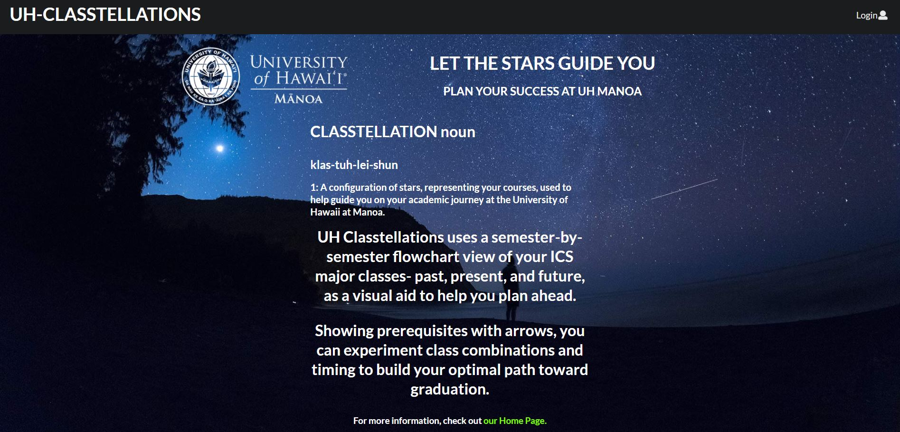

  

 
 Classtellations was the name of the application that my group and I designed and created. The point of this application was to create a drag and drop type of user interface, to allow students to drag courses and drop them into a flow chart. The students can then print this chart, and have a plan on paper as to go abuot how to register for classes each semester.
 
 Star UH Gps already does this, however, since the site is a bit bulky, and has a lot of moving parts, this simplifies the process if the student just wants to get an idea of how to plan their education. The application also provides info on teachers and provides a course list for ICS majors, as well has has info on counselors for the ICS program, and implements a download as pdf button.
 
 The group was spit up to share work on different pages. I designed the aesthetics of the page, created the login and landing page features, as well as implemented the download as pdf button on the drag and drop page. I also assisted in debugging, and managed to help my other group members debug two major issues that were preventing pages from displaying properly.
 
 I learned a lot, and really enjoyed my group members. Everyone was helpful, did their share, and communicated effectively. I wish to do more group projects in the future, and my knowledge I gained from this project will definitely help me.
