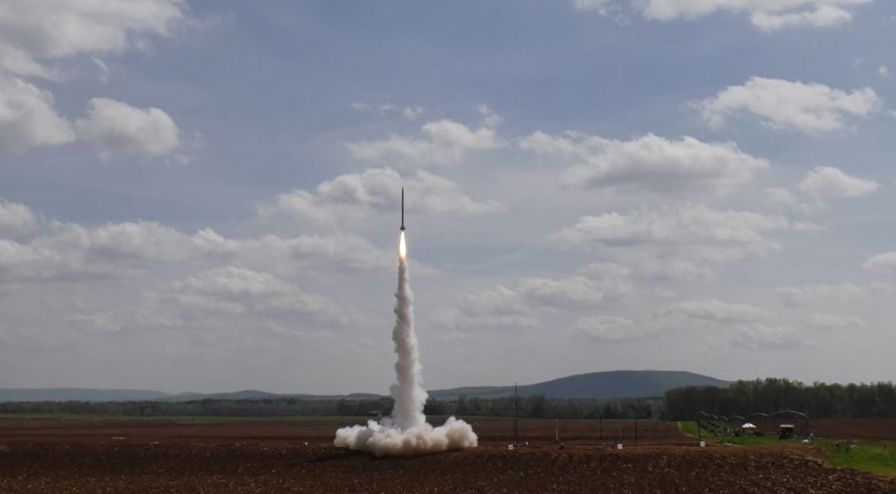

  

 
  The Nasa Rocketry program was one of the first major projects that I was a part of. The mission for this project was to create a rocket with an onboard payload that had to meet certain requirements after the payload was released. The requirement for the payload was to send information back to a laptop that was being monitored on the ground, while simultaneously drifting down to the ground towards a specific target.
  
  The project was divided into different groups. While others were a part of the mechanical side of the project, which included building the rocket and testing it under fluid flow conditions, I was a part of the electrical side which was in charge of the payload itself.
  
  The payload included a centralized microcontroller, servos to control the parachute of the payload, an altimeter and a camera. My specific task was to program the Arduino microcontroller to take pictures of the ground using the camera, and using that data to control the servos to move the parachute so that the payload would drift towards a deisgnated target. 
  
  This was my first time working with Arduino and I learned a lot!

