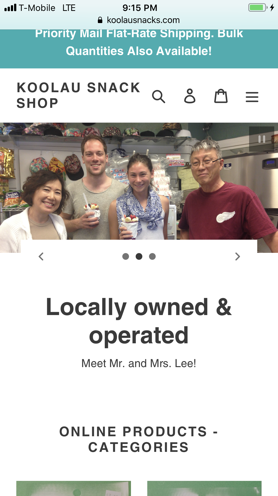

During the Covid-19 crisis, many small local businesses were heavily affected and losing business due to the quarantine. My goal for this project was to show the practical and real application of technology to solve a crisis. The owner of the store was an elderly couple that did not have much experience with technology. 

During the course of the project, I researched, planned, then executed and tested my page to make sure that the page was able to run without any problems. Since it was my first time building a website, a lot of my time was put into research. My research helped me learn about web security, including SSL and secure payment options, web hosting, web design, visual business psychology and much more. 

The project was successful, and the website is still active and helps the owners of Koolau Snack Shop alleviate economic pressure. It was actually quite fun, and I gained a lot of experience with HTML, mobile vs full sized monitor transitioning, and imbedded SQL for keeping database integrity. I also learned about other tools that are available for web owners, such as having alerts sent directly to a linked cellphone whenever a purchase was made. 
 

Source: <a href="https://github.com/krnkev/Websitebuild.md"><i class="large github icon "></i>krnkev/Websitebuild.md</a>
